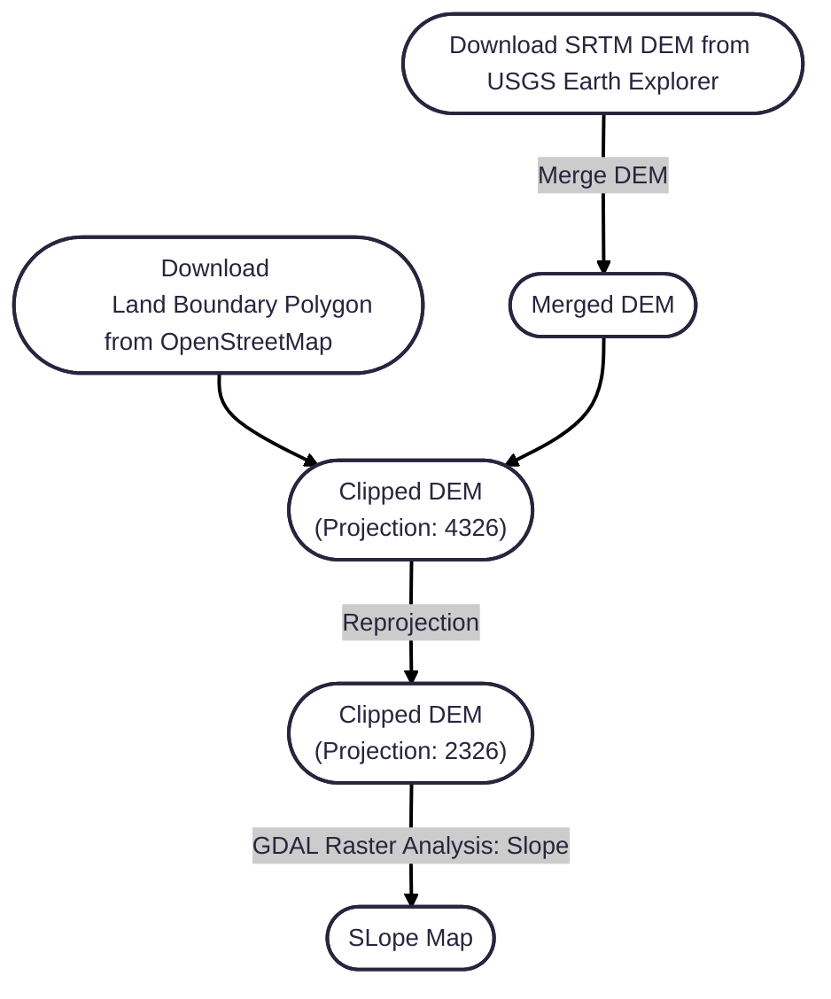

# Slope Map of Hong Kong for Hiker Route Planning

## Objective & Motivation
Inspired by [bergfex.de](https://www.bergfex.de/), this project generates a detailed slope gradient map of Hong Kong using a Digital Elevation Model (DEM). The workflow involves merging multiple raster tiles, reprojecting data to a suitable coordinate system, and computing slope gradients using GIS tools.
The resulting map highlights areas of steep and gentle terrain, providing valuable insights for hikers to plan their routes more safely and efficiently by understanding elevation changes along their paths.

